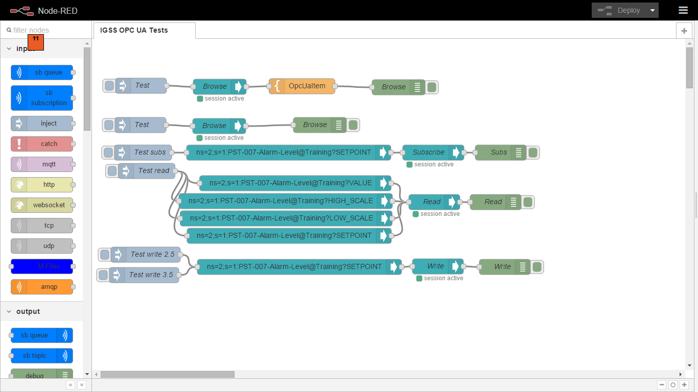
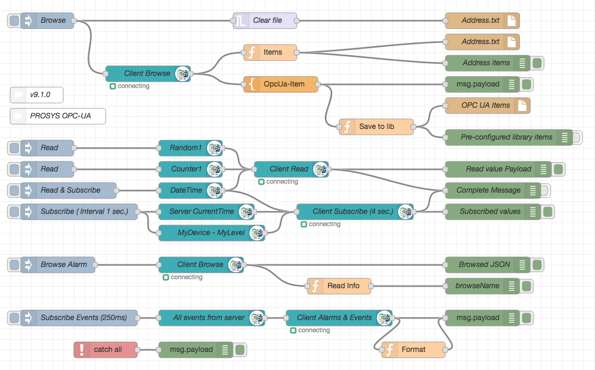
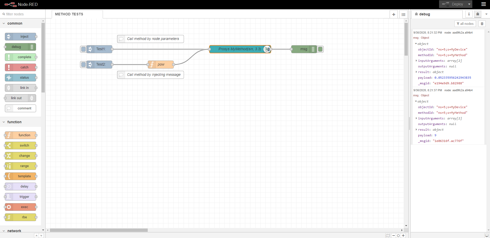
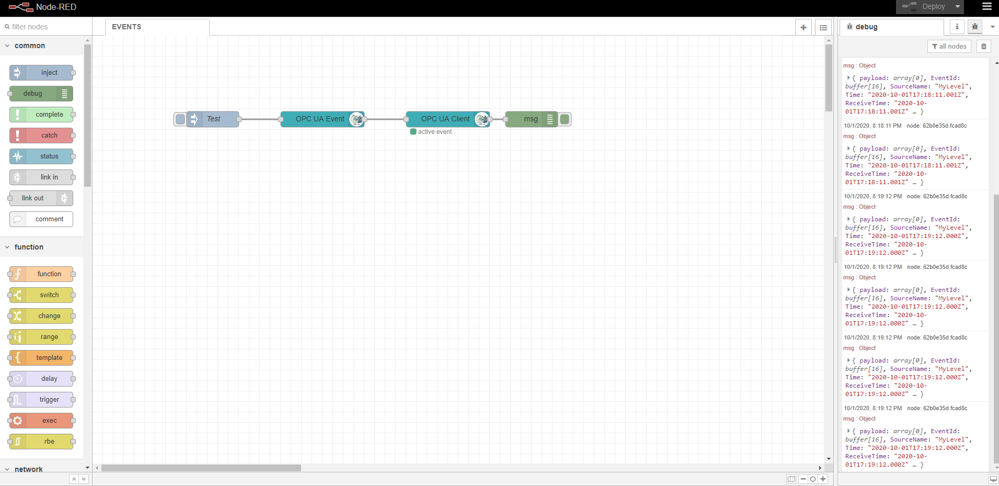

node-red-contrib-opcua
========================

A [Node-RED][1] nodes to communicate or serve via [OPC UA](https://www.npmjs.com/package/node-opcua).

based on [node-opcua](http://node-opcua.github.io/)

Install
-------

Run command on Node-RED installation directory.

	npm install node-red-contrib-opcua

or run command for global installation.

	npm install -g node-red-contrib-opcua

Usage
-----

Use OpcUa-Item to define variables.
Use OpcUa-Client to read / write / subscribe / browse OPC UA server.

See some flows under [Examples](examples).
Updated server sub-flow example OPCUA-TEST-NODES.json look commands: addFolder, AddVariable, setFolder.

Here you got some ready to use examples.
You can use the Import in Node-RED in the right upper corner menu.

Examples are available for Schneider IGSS and Prosys Simulation Server as Node-RED flow.
Search for OPC UA on: http://flows.nodered.org/

Message parameters
------------------

Input message
----

| __**Property**__   | __**Function/Value**__    | __**Notes**__             |
|--------------------|---------------------------|---------------------------|
|  payload 	         | set interval for subscription or monitorItem
|  interval	         | Subscription interval     |
|  queueSize	     | Subscription queue size   |
|  deadbandType      | "a" abs. or "p" percent   | Action monitor
|  deadbandValue     | integer for deadband      | Action monitor
|  topic		     | NodeId and DataType in format ns=3;s=Counter;datatype=Int32
|  action            | subscribe                 | nodeId / variable
|                    | unsubscribe               | nodeId / variable
|                    | deletesubscription        | subscription
|                    | browse                    | nodeId / folder
|                    | info                      | nodeId
|                    | read                      | nodeId
|                    | write                     | nodeId & value
|                    | monitor                   | deadbandtype abs/pro
|                    | events                    | nodeId
|                    | readmultiple              | [nodeId + datatype]
|                    | writemultiple             | [nodeId + datatype + value]

readmultiple to readmultiple items
writemultiple to write multiple items
clearitems to empty multiple items (readmultiple / writemultiple)

NOTE: With datatype=xxxArray msg.payload.range = "2:4" can used as indexRange to read/write partial array

Output message
----

| __**Property**__   | __**Function/Value**__    | __**Notes**__             |
|--------------------|---------------------------|---------------------------|
|  payload           | dataValue.value.value     |                           |
|  statusCode	     | OPC UA StatusCode         |                           |
|  sourceTimestamp	 | Source timestamp          |                           |
|  serverTimestamp   | Server´s timestamp        |                           |

Release history (only couple of older releases):

**v0.2.111**

Fixed DateTime conversion (write). 

**v0.2.110**

Added 2D and 3D array support. Examples: 
ns=1;s=Float2D;datatype=FloatArray[5,5] 
ns=1;s=Float3D;datatype=FloatArray[5,5,5] 
NOTE: Write range uses msg.range 
New feature msg.payload.range can be used to read part of Array 
New feature msg.range can be used to write part of Array 
Updated example OPCUA-TEST-NODES.json 

**v0.2.109**

Added array range examples (examples/OPCUA-TEST-NODES.json). 
Send only if payload contains something. 
Added msg.payload.range usage 
New feature msg.payload.range can be used to read/write part of Array 
Fix: FQDN -> hostname in makeAplicationUri 
EventId and statustext as clear string 
EventId as hex string 

**v0.2.108 and older**

Fixed support for server Array variables 
Browse will create topic and datatype thus output can be connected. Next node can progress output msg. 
Refactored browse action fast and simple 
Merged event payload fix. Merge pull request #265 from list3f/master 
Put OPC UA event data in msg.payload 

# Advanced examples
- needed from users (add links to examples folder)

# Authors

* since 2015 [Mika Karaila][2]
* since 2016 [Klaus Landsdorf][3]

Testing
------

    karma start opcua.conf.js --log-level debug --single-run

TBD List
-----

| __**Nodes**__      | __**Function**__          | __**Done**__              |
|--------------------|---------------------------|---------------------------|
|  All               |                           |                           |
|                    | Project structure         | :white_check_mark:        |
|                    | Async calls               | :waxing_crescent_moon:    |
|                    | UnitTesting               | :new_moon:                |
|                    | Documentation             | :first_quarter_moon:    |
|  Item              |                           | :white_check_mark:        |
|  Browser           |                           |                           |
|                    | Browse                    | :white_check_mark:        |
|                    | Simple UI interface       | :first_quarter_moon:      |
|  Client            |                           |                           |
|                    | Read                      | :white_check_mark:        |
|                    | Read Multiple             | :white_check_mark:        |
|                    | Write                     | :white_check_mark:        |
|                    | Write Multiple            | :white_check_mark:        |
|                    | Subscribe                 | :white_check_mark:        |
|                    | Unsubscribe               | :white_check_mark:        |
|                    | DeleteSubscription        | :white_check_mark:        |
|                    | Info                      | :white_check_mark:        |
|                    | Browse                    | :white_check_mark:        |
|                    | AE                        | :new_moon:                |
|                    | reconnect on error        | :waxing_crescent_moon:    |
|  Server            |                           |                           |
|      Commands      |                           |                           |
|                    | Restart                   | :white_check_mark:        |
|                    | Add Folder                | :white_check_mark:        |
|                    | Set Folder                | :white_check_mark:        |
|                    | Add Variable              | :white_check_mark:        |
|                    | Add Object                | :new_moon:                |
|                    | Add Method                | :new_moon:                |
|                    | Add Equipment             | :first_quarter_moon:      |
|                    | Add PhysicalAssets        | :first_quarter_moon:      |
|                    |                           |                           |
|                    | Delete by NodeId          | :white_check_mark:        |
|      Examples      |                           |                           |
|                    | Methods                   |                           |
|                    | Structures                |                           |
|                    | Variables                 |                           |
|                    | Objects                   |                           |
|                    | AE                        |                           |
|                    |                           |                           |
|  Alarm and Events  |                           |                           |
|                    | Subscribe                 | :white_check_mark:        |
|                    |                           |                           |

[EMOJI CHEAT SHEET](http://www.emoji-cheat-sheet.com/)

[1]:http://nodered.org
[2]:https://github.com/mikakaraila
[3]:https://github.com/biancode